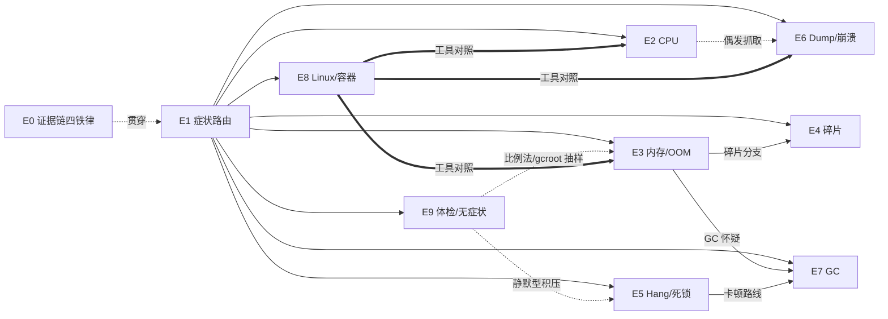

# dotnet-production-debug — INDEX

> 本 skill 的完整参考手册:工具矩阵、命令速查、异常代码表、根因全目录、版本差异、术语词典。
> 一句话主旨:生产 .NET 故障排查是一门法医学——症状路由 → 分层定性 → 双快照取证 → 证据链定罪,不信描述只信数据。
> 主文件:[SKILL.md](./SKILL.md)(决策路径与反模式在 E2–E8)

---

## 1. 症状 → 章节速查

| 症状关键词 | SKILL.md 章节 | 首选工具(Windows) | 首选工具(Linux) |
|---|---|---|---|
| CPU 持续/偶发飙高 | E2 | procdump 埋伏 + windbg(!tp/!syncblk/!runaway) | perfcollect → PerfView;procdump -c |
| 内存涨/OOM/泄漏 | E3 | VMMap + windbg(!address/!eeheap/!dumpheap/!gcroot/!heap) + PerfView gcdump | dotnet-dump analyze(eeheap/dumpheap/gcroot/gchandles;无内存视图命令)+ heaptrack/perf |
| 涨但对象统计对不上 | E4(碎片) | windbg(!dumpheap 单段布局)+ PerfView Gen2 Deaths | 同左(sos 通用) |
| 卡死/挂死/死锁 | E5 | windbg(~*e !clrstack/!syncblk/!tp) | dotnet-dump analyze(clrstack -all/threadpool/syncblk,差异见 §3.1) |
| 线程数爆高/饥饿 | E5 | !tp + ~*e .ttime + !dso | dotnet-counters(经验未覆盖具体 counter 名) |
| 崩溃/异常退出 | E6 | procdump/AeDebug/WER + !analyze -v | createdump 环境变量 + dotnet-dump |
| GC 频繁/停顿/降不下去 | E7 | PerfView GCStats + !eeheap -gc + !fq | 经验未覆盖(Windows 工具链) |
| 慢请求/慢 SQL/慢 File | A7 工具矩阵 | DotTrace Timeline(Incoming HTTP/SQL/File 事件) | dottrace CLI 跨平台采 .dtp |
| 偶发超时(dump 查不出) | A11 降层 | wireshark 看 SYN/RTO 重传 | tcpdump |
| Linux/容器任何故障 | E8 | — | createdump/dotnet-dump/perfcollect/heaptrack |
| 无症状/体检/潜在问题扫描 | E9 | dotnet-dump analyze 体检组合(分诊三问 + dumpasync + 比例法 + gcroot 抽样) | 同左 |

---

## 2. 工具选型矩阵(完整版)

| 症状 | Windows 工具链 | Linux 工具链 | GUI(DotTrace/DotMemory/PerfView) |
|---|---|---|---|
| CPU 高 | dump + windbg(!runaway 双 dump 差值、~*e !clrstack) | perfcollect + PerfMapEnabled → trace.zip 回 PerfView | DotTrace Sampling 宏观 → Tracing 下钻;Timeline 真实场景最多 |
| 内存涨 | VMMap 定性 → PerfView 附加采 snapshot(开销最小) | dotMemory Console `get-snapshot`(产 .dmw 回 Windows) | DotMemory 双快照 Diff;生产装不上商业软件 → dump 离线导入 |
| 泄漏 | 正常/异常双 dump → PerfView gcdump `Diff - With Baseline` | 同思路,dotMemory Console 抓快照 | gcdump Diff 直接显示增量被哪个静态变量持有 |
| 卡死 | windbg 锁链分析;wireshark(通讯层) | dotnet-dump analyze | DotTrace Timeline 墙钟时间 + Thread State 面板 |
| 崩溃 | procdump/AeDebug/WER + !analyze -v | createdump ENV / procdump / DiagnosticsClient | 经验未覆盖 |
| 慢请求 | DotTrace Timeline `Incoming HTTP Requests`(独家) | dottrace CLI Timeline,.dtp 回 Windows | 累计时间最高 ≠ 单次最慢,放大选单次 |
| GC 异常 | PerfView GCStats/GC detail | 经验未覆盖 | GC 次数少时 DotTrace Timeline 可看 GC Wait |

**开销等级(经验实测口径)**:

| 工具/模式 | 开销 | 适用粒度 |
|---|---|---|
| PerfView 附加进程 | **最小**(实测 < DotMemory) | 生产采 dump/heap snapshot 首选 |
| DotTrace Sampling | 小(5-11ms 采样) | 天级长期监控;<5ms 函数捕获不到 |
| DotTrace Tracing | 较大(方法级 enter/leave) | 小时级 |
| DotTrace Timeline+ETW | 中(关 ETW 吞吐快近 3 倍——观测扭曲) | 真实场景 |
| DotTrace Line-by-Line | 极大(IL 插桩) | 只做局部(JetBrains.Profiler.Api) |
| DotMemory Full 采样 | 高(高分配负载"几乎无法跑") | 换 Sampled 模式 |
| windbg 分析大 dump | **单 dump ≤10G**,否则分发慢、sos 数小时、分析机内存不足 | 超限走 VMMap + gcdump |

---

## 3. windbg / SOS 命令速查(按场景)

**通用**: `!analyze -v`、`.ecxr`(异常上下文)、`!t`/`!threads`(线程表,Exception 列/State 列)、`~Ns`(切线程)、`~*e !clrstack`(全线程托管栈)、`!clrstack -a`(含参数局部变量)、`k`/`kb`(非托管栈)、`!peb`、`!teb`、`!dh`(PE 头)、`!ip2md`(指令→托管方法)、`!name2ee`/`!savemodule`(取模块反编译)、`!U`/`!U -gcinfo`(反汇编/gcinfo)、`!do`/`!da -details`/`!dso`(栈上对象)、`!gle`(LastError)。

| 场景 | 命令 |
|---|---|
| CPU | `!tp`(线程池:CPU%/Running/Idle/队列)、`!cpuid`、`!runaway`(线程耗时长,双 dump 差值)、`!syncblk`(锁表)、`!mlocks`(thinlock)、`dp clr!SVR::gc_heap::gc_started`(GC 触发中)、`dp clr!SVR::GCHeap::GcCondemnedGeneration`(2=FullGC)、`!wdae`(异常统计,netext)、`!whttp`(请求时长,netext) |
| 内存(托管) | `!address -summary`(Linux dump 换 `!maddress -summary`,仅 windbg≥1.2402;dotnet-dump 无内存视图命令)、`!eeheap -gc`、`!eeheap -loader`、`!dumpheap -stat [-min N]`、`!dumpheap -mt <MT> [-short]`、`!gcroot [-all] <addr>`、`!objsize`、`!strings`、`!dumpdelegate`、`s-q <范围> <addr>`(全堆搜引用)、`!lno`(邻近对象)、`!gchandles -stat`(GC 句柄含 Pinned)、`dumpvc <MT> <addr>`(内嵌值类型字段:Nullable/TimeSpan 等,`!do` 对内嵌结构体无效) |
| 内存(非托管) | `!heap -s`(NT 堆列表)、`!heap -stat -h <handle>`、`!heap -flt s <size>`、`!heap -p -a <block>`(需 UST)、`!heap <handle> -m`(VirtualAllocdBlocks)、`dt nt!_HEAP`(手工挖 +0x118)、`gflags /i <exe> +ust`(事前开)、`!gflag`(确认 0x1000) |
| 句柄 | `!handle`(按类型统计)、`!htrace -enable/-diff/-snapshot`(活进程 NT 句柄)、`dt ntdll!_PEB GdiSharedHandleTable`(GDI 表)、`bm gdi32!*Bitmap* "k; gc"`(GDI 断点) |
| 碎片 | `!dumpheap <seg-begin> <end>`(单段布局)、`!dumpheap -type Free`、`!do <Free>`(Free Object)、`dc <addr>`(窥生前残留)、`!dumpgen 2 -free -stat`(sosex,碎片占比) |
| Hang | `!syncblk`(MonitorHeld=1+等待×2)、`!dso`、`!tp`、`~*e .ttime`(线程创建时间→注入速率)、`!cs <addr>`(非托管临界区)、`!handle <h> f`(解句柄类型)、`!t` State 列 0x200(后台线程标记) |
| GC | `!eeheap -gc`(Allocated vs Committed)、`!eeversion`、`!fq`/`!finalizequeue`(终结队列)、`!frq -stat`(sosex)、`x coreclr!GCConfig*`(s_ConcurrentGC/s_ServerGC)、`dt coreclr!WKS::gc_heap::settings`(background_p/b_state)、`!verifyheap`(⚠ No corruption 不可全信) |
| 崩溃 | `.exr -1`(异常记录)、`r rsp` + `!teb`(栈哨兵页)、`!heap -s`(Error type)、`uf <func>`(cookie 布局)、`!pe -nested`(嵌套异常)、`gflags -i <exe> +hpa`(页堆)、`!vm`/`!poolused 2`(内核池,需内核 dump) |
| 异步 | `dumpasync`(在途请求数/`Awaiting:` 卡点分布/中间件链;异步服务端第一动作,线程栈常全闲)、`dumpheap -stat -type <状态机类名>`(在途调用计数,作比例法活跃基线,见 SKILL E9 第 4 步) |

**sosex 救场**(sos 因堆损坏趴窝时): `!mdso`(按栈列对象)、`!mdt -e:N`(展开字段树)、`!dlk`(自动死锁检测)、`!U /d`(反编译带源码行)。

**gcroot 实战二注**:
1. **判生死**:某类型实例数量巨大时(如数千个 HttpClient),从其 `dumpheap -mt` 列表等距取 10+ 个地址逐个 `gcroot`,统计 `Found 0 unique roots` 占比——占比高说明多为"未回收垃圾"(低分配压力下 Gen2 GC 很懒),不是泄漏;多数有根才是真持有,再看路径收敛方向。
2. **假路径**:gcroot 给的是"某条可达路径",穿过全局共享结构(SocketAsyncEngine 的 epoll 注册表、TimerQueue 内部链表、DI 中间件单例)的路径不反映真归因——如"TimerQueueTimer 多达 315 个"看着像泄漏,实为在途定时器的链表串联(≈并发请求数 × 每请求 2 个超时定时器)。见到"可疑根"必须用计数互校/双快照复核。

### 3.1 dotnet-dump analyze 速查(实测 9.0.x;Windows/Linux dump 通吃)

自带 sos、位数自适应、托管栈免配符号——E6 的"环境三要素"全免,是 **Linux dump 与快速分诊的事实首选**。
短板:**无任何内存视图命令**(`!address`/`!maddress`/`!vm` 均不可用),非托管布局只能回 windbg 或 Linux 本机工具。业务帧解析分两层:① 类型/方法名 ← DLL 元数据(缺它即 `!Unknown`,与 PDB 无关;Windows 分析 Linux dump 时把同构建产物平铺进当前盘根 `publish` 目录,见 SKILL E8 两层论);② 源码行号 ← PDB。`_NT_SYMBOL_PATH` 本地目录只作用于 PDB 层,解不了 ①。

| windbg 写法 | dotnet-dump 等价 | 备注 |
|---|---|---|
| `~*e !clrstack` | `clrstack -all` | 全线程栈扫视 |
| `!tp` | `threadpool` | CPU%/Workers/队列 |
| `!t` / `~Ns` | `threads` / `switchthread N` | 线程表/切线程 |
| `!pe` | `printexception` | 当前线程异常 |
| `!do <内嵌结构体地址>` | `dumpvc <MT> <addr>` | 读 Nullable/TimeSpan 等值类型字段(`do` 无效) |
| `!peb` / `!teb` / `!address` / `!maddress` | 无 | Windows 概念或 windbg 专属 |
| `~*e .ttime` / `k` / `!dso` / `!runaway` / `!cs` | 无 | 非托管栈/线程时间/windbg 专属 |

实测可用:`syncblk` · `eeheap -gc|-loader` · `eeversion` · `dumpheap -stat|-min|-mt|-type|-short` · `do` · `dumpvc` · `gcroot` · `gchandles` · `dumpasync` · `finalizequeue` · `analyze -v` · `ip2md`。

**异步专属利器 `dumpasync`**:异步服务端(ASP.NET Core)线程栈常全闲,现场在 Task 图——输出按 `STACK N` 段数即在途请求数,聚合 `Awaiting:` 后的 awaiter 类型看卡点分布,帧链自带中间件/弹性策略全貌。

**批量模式**(非交互/AI 分析必备):

```sh
printf 'cmd1\ncmd2\nexit\n' | dotnet-dump analyze app.dmp > triage.log 2>&1
# 大输出(全线程栈可达数百 KB)重定向到文件,再用 Grep/awk 提炼模式,勿直接读
```

---

## 4. 异常代码表

| Code | 含义 | 首动作 |
|---|---|---|
| c00000fd | 栈溢出 | `.excr;k` 找递归模式;RSP 进哨兵区即触发(不代表栈真用完) |
| c0000005 | 访问违例 | 看崩溃函数:GC 标记帧→堆损坏法医学;地址 0→空引用;第三方模块→归属 |
| c0000374 | NT 堆损坏 | `!heap -s` Error type(NOT_BUSY=Double Free) |
| c0000409 | 栈 cookie/FAST_FAIL | uf 验算;完好仍崩→OS/硬件 |
| c0000094 | 整数除零 | 栈即定位 |
| c0000008 | 无效句柄 | NtClose 了不属于进程的 handle |
| E0434352 / E0434F4D(.NET5+) | 托管异常标记 | !t Exception 列 → !pe -nested;HResult 8007000e=OOM |
| 80000003 | int3 软 trap | 抓 dump 冻结产物,99% 正常 |
| SIGSEGV/SIGABRT(Linux) | 段错误/abort | dump 头 si_code:SI_USER=用户态 kill;退出码 139 |

---

## 5. Windows / Linux 工具对照总表

| 目的 | Windows | Linux(经验口径) |
|---|---|---|
| 抓 dump(崩溃) | procdump -e / AeDebug / WER | createdump ENV(`COMPlus_Dbg*`)/ procdump for Linux / DiagnosticsClient.WriteDump |
| 抓 dump(活体) | 任务管理器 / procdump -ma(32bit 抓 GDI 用 -64) | `dotnet-dump collect -p <pid>` |
| 分析 dump | windbg + sos/sosex/netext | dotnet-dump analyze(命令名与 windbg 有差异,见 §3.1;Windows 机分析 Linux dump 需同构建产物放当前盘根 `publish` 目录,见 SKILL E8)/ 拷回 windbg 手工 .load sos / WinDbg≥1.2402 连 gdbserver |
| CPU 采样 | PerfView(ETW) | perfcollect(perf+LTTng)→ trace.zip 回 PerfView;需 PerfMapEnabled=1 |
| 内存布局 | VMMap、Process Explorer | /proc/\<pid\>/maps + pmap;windbg≥1.2402 内 `!maddress`(dotnet-dump analyze 不支持;Linux 线程栈默认 8M 实占) |
| 非托管泄漏取证 | UST(gflags)+ !heap -p -a | heaptrack(malloc 系)/ perf trace mmap;unresolved 符号 ip2md 反查 |
| 内存错误检测 | App Verifier / 页堆 | Valgrind(**仅纯 C/C++**,不适用 .NET) |
| 句柄追踪 | !htrace / PerfView Handle ETW / GDIView | 经验未覆盖 |
| 锁竞争量化 | PerfView ContentionKeyword | dotnet-trace contention(EventPipe 跨平台) |
| 函数 hook | MinHook/Detours/Harmony | LD_PRELOAD(库级)/ funchook(函数级)/ Harmony(托管) |
| 网络层 | wireshark | tcpdump/wireshark |
| 内核级 | 双机内核调试、!pcr/!poolused | 经验未覆盖 |

---

## 6. 根因全目录(7 场景 × 行级摘要)

### CPU(32 类,Top 摘要)
| 根因 | 关键证据 | 修复 |
|---|---|---|
| string 海量拼接 → LOH/GC | 多线程卡 String.Concat;SuspendEE | StringBuilder |
| List 扩容触发 GC | List.set_Capacity→trigger_gc_for_alloc | 优化查询/64bit |
| 32bit 地址紧张连续 FullGC | GcCondemnedGeneration=2;!address 逼近 4G | 改 64bit |
| bgc 蝴蝶效应 | 无 SuspendEE;backgroundgc SetFree 线程==核数 | 消灭全量捞数 |
| lock convoy(Application 赋值群) | !syncblk 同锁大量 waiter;Session_Start 105 个赋值 | 挪 Application_Start |
| Dictionary 成环死循环 | 25+ 线程卡 FindEntry;next 自指 | 线程安全集合 |
| Task.Delay 未 await | Delay 后直接回循环体 | 理解语义 |
| 数据成环 while 死循环 | !mdt 导出见两项互指 | 循环设上限 |
| O(N²)(Insert(0)/ForEach+FirstOrDefault) | _size=23w;双 dump top 线程 | 先 Add 后排序/建索引 |
| LINQ 谓词内 DES 解密 | WhereListIterator 反复调 lambda | 提到查询外 |
| 正则替换 20M SQL | _stringLength=10695743 | 5000 条/批 |
| ConcurrentDictionary.Values | 单线程 1000+ thinlock;new 54.3w List | lock+Dictionary |
| 400+ 线程 Sleep(1) | 全卡 SleepInternal;线程数 vs 线程池悬殊 | 减线程/50ms+ |
| 第三方 SDK 原生 bug | 托管栈全废;!dumpstack 见 142 个 native 线程 | 升级 SDK |
| 异常风暴 | !t Exception 列;!wdae 808 个 | Polly 弹性处理 |
| NPOI AutoSizeColumn | 栈见 AutoSizeColumn | 慎用 |
| 安全软件干扰 | 排除法 | 放行 |

### 内存(16 类)
静态集合无界增长 / 事件订阅·变更令牌未解除(PropertyChanged 链、CompositeChangeToken) / 缓存·自制池无上限 / 终结器积压(STA+COM 卡死 finalizer,7w+ 积压) / P/Invoke 未释放(halcon!HXmalloc 类) / GDI 句柄(GetHbitmap/CreateDCW) / NT 句柄(Event 1337、FileSystemWatcher Async Pinned) / 程序集泄漏(XmlSerializer rootName、ProxyGenerator、Roslyn Scripting) / 大集合突发(嵌套 Dictionary 279M) / 字符串 intern 膨胀 / 线程爆炸吃栈(Stack 176GB、Linux 8M 实占) / 内核模式池(!poolused Tag) / 安全软件注入(prthook/dcfafilter) / 框架 bug(DI EventSource 6087w WeakReference、3.1.20 死锁、Server GC 黑洞) / x86 2G 耗尽 / LOH 碎片。

### 碎片(6 类)
FSW 缓冲 async pin(ReloadOnChange 经典/非经典) / GCHandle Pinned 不 Free / 长寿命积压夹 Free(日志队列 395w) / LOH 一大一小交替 / 大文件 byte[]↔string 转换(暴涨非碎片) / gen2 pinned region(.NET8 4M region)。

### Hang(25 类,Top 摘要)
双锁/三角死锁(MongoDB 驱动锁内回调) / Task.Result 两形态 / 锁内 Invoke·IO·事件 / 读写锁写锁内 SQLite 刷盘 / 持有线程被 C++ 销毁锁泄漏 / SemaphoreSlim 未归还 / 混合锁污染(HSL 吞异常) / Timer 回调进锁重入(CSRedis) / Sleep 轮询占线程(HSL CheckTimeOut) / FSW 回调风暴(3.4w watcher) / 非 UI 线程建控件(UserPreferenceChanged) / UI 线程重 IO / 双检锁重初始化 / 前台线程阻塞退出 / Console QuickEdit / 调试器伪卡死 / 杀软劫持 / 连接池耗尽 / GC STW 卡顿 / **静默型异步积压**(线程全闲 + dumpasync 在途数 ≫ 活跃基线 + 长超时钉死并发槽 + 无取消传导;双快照计数实锤,根因须回源码核实,见 SKILL 案例 6)。

### 崩溃(16 类)
无限递归 c00000fd / NT 堆 Double Free c0000374 / C++ 越界写托管堆 / PInvoke 未固定对象 / native 强杀线程(TerminateThread) / 托管线程栈释放后 GC 爬栈 / **辐射 bit 翻转**(差 1-3 bit) / 栈 cookie c0000409 / 32 位地址耗尽 / GDI+ 耗尽伪装 OOM / 无效句柄 c0000008 / 第三方 native SDK / 安全软件误杀 / Finalizer 线程崩溃(SIGSEGV,Linux) / CLR 框架 bug(bgc revisit_written_pages) / 生产遗留 Debugger.Break。

### GC(8 类)
高频小对象分配 / LOH 大对象压力 / 终结器慢积压(49.9w Person、字符串浪费 3.63G) / 静态根持有 / GC.Collect 误用正用 / Server GC 黑洞(852M vs 16.6G) / 后台 GC 关闭·模式不对 / 停顿阶段归因(GCScanRoots vs relocate_phase)。

### Linux(8 类)
P/Invoke malloc 不 free / mmap 不 munmap / Finalizer 阻塞→非托管积压(lambda_method 3.64G) / 信号触发崩溃(SI_USER) / 容器权限不足 / dump 未挂载丢失 / SystemV 共享内存误报(正常 IPC) / 动态代码失控。

---

## 7. 版本差异总表

| 维度 | .NET Framework | .NET Core / .NET 6 | .NET 8+ |
|---|---|---|---|
| Dictionary 并发损坏 | FindEntry 死循环打爆 CPU | 遍历 entries.Length 次后抛 InvalidOperationException | 同 Core |
| 线程池实现 | C++ win32threadpool;GateThread ~1s 注入 1 线程 | C# PortableThreadPool | Task.Result 触发 NotifyThreadBlocked 主动唤醒(250ms);**异步回调两次 Enqueue 放大饥饿**(.NET 6 是 IO 线程一撸到底) |
| SynchronizationContext | WinForm/WPF/MVC 有(Task.Result 死锁温床) | asp.net core 移除(仍可饥饿) | 同 |
| 线程栈 | 1-1.5M | 同(Windows);Linux 默认 8M 实占 | 同 |
| null 赋值回收 | Debug 有效/Release 激进回收 | .NET5+ 双栈位 null 无效 | 同 |
| 托管异常码 | E0434352 | .NET5+ E0434F4D | 同 |
| sos 加载 | 框架目录自带 | dotnet-sos install | 同;AOT 无 coreclr 模块 SOS 失效 |
| GC | ngen *.ni.dll | System_Private_CoreLib | .NET 7 WXORX 双映射;.NET 10 DATAS 缓解 Server GC 黑洞 |
| 已知框架 bug | — | 3.1.20 CompositeChangeToken 死锁(3.1.32 修) | DI EventSource 弱引用泄漏(.NET 10 修) |
| 环境变量 | — | COMPlus_ 前缀 | DOTNET_ 前缀(等价) |
| 调试钩子 | — | — | `ThreadPool.DebugBreakOnWorkerStarvation` AppContext 开关 |
| 支持状态(截至 2026-08) | 4.8.x 随 Windows 生命周期续安全更新(无新功能) | Core 3.1/.NET 5/6/7 均已 EOL(6 止于 2024-11-12) | .NET 8 LTS 至 2026-11;.NET 9 已 EOL(2026-05);.NET 10 LTS——体检见 EOL 必报为风险项 |

---

## 8. 反模式总清单(跨场景 Top 21,完整版见 SKILL.md 各场景)

| # | 反模式 | 场景 | 一句话正确做法 |
|---|---|---|---|
| 1 | Task.Result/.Wait() 同步等异步 | Hang | 全链路 await,库代码 ConfigureAwait(false) |
| 2 | 锁内 IO/Invoke/事件回调 | Hang/CPU | 出锁后再做 |
| 3 | reloadOnChange:true + 反复 Build Configuration | 碎片/Hang/内存 | 构建一次复用,不需要热更就 false |
| 4 | 非线程安全 Dictionary 多线程共享 | CPU | 线程安全集合 |
| 5 | XmlSerializer 带 rootName 不缓存 | 内存 | 缓存实例 |
| 6 | 一次性读 10w+ 行进内存 | 内存/CPU | 分批 |
| 7 | 32bit 部署大内存业务 | CPU/内存 | 64bit |
| 8 | 偶发故障手工蹲守抓 dump | CPU | procdump 阈值埋伏 |
| 9 | 到处 GC.Collect | GC | 量化碎片占比后再用 |
| 10 | 给纯托管对象加 finalizer / finalizer 做慢操作 | GC/内存 | Dispose + SuppressFinalize |
| 11 | 非 UI 线程创建控件 | Hang | Invoke 回 UI |
| 12 | UI 线程干重活 | Hang | Task.Run |
| 13 | Timer 回调慢于间隔 | Hang | 快进快出/闸门 |
| 14 | 线程池线程 Sleep 轮询做超时 | Hang | 异步超时 |
| 15 | P/Invoke 资源不明确释放 | 内存/崩溃 | 封装 Dispose;GCHandle 固定 |
| 16 | 超 10G dump 硬开 windbg | 内存 | VMMap + gcdump Diff |
| 17 | NTHeap 泄漏事后才开 UST | 内存 | 判定即开 |
| 18 | WER 只配 Mini dump 分析托管堆 | Dump | DumpType=2 |
| 19 | 对 .NET 用 Valgrind / ulimit core 抓托管崩溃 | Linux | createdump ENV + heaptrack/perf |
| 20 | 看到最显眼的异常就当根因 | 全部 | 再卜一卦二次取证 |
| 21 | 长超时钉槽位 + 无取消传导(下游慢/挂,长 HttpClient.Timeout 钉死并发槽;无 CT 传导,悬挂操作钉死代理/客户端/连接) | Hang/内存 | 超时熔断器(谓词只认超时)+ CT 端到端穿透;先读代码确认队列/超时实况 |

---

## 9. 术语词典(共享)

**内存**: Reserved/Committed/Free(虚拟地址三态) · Virtual Size = Reserved+Committed · Working Set = WS Private+WS Shareable · Private Bytes = WS Private+Pages Out(泄漏排查先看它) · NTHeap · LOH/SOH/POH(≥85000 字节/小对象/固定对象堆) · Loader Heap · Free Object · gcdump(<1M 堆快照) · UST(用户态栈跟踪库) · LFH/Internal(NTHeap 前端堆标记) · HEAP_ENTRY(Size 异或编码×16) · VirtualAllocdBlocks(>512K 块链表) · barrier(8216) · DATAS(.NET10 动态 GC 策略) · TEB。

**GC**: Gen0/1/2 · 后台 GC(初始STW→并发标记→最终STW) · STW · SuspendEE(冻结执行引擎;!t -special 标记) · Finalizer Queue/f-reachable(!fq;两次 GC 才回收) · Server/Workstation GC(堆数=核数) · GC 黑洞(Committed≫Allocated) · gc_reason(14 种触发原因) · GC_MARKED(mt bit0 正常置位) · untracked local(JIT 不跟踪栈槽)。

**线程/锁**: SyncBlock/MonitorHeld(1+等待×2) · AwareLock · thinlock · lock convoy · SynchronizationContext · GateThread/线程注入(500ms 周期) · NotifyThreadBlocked(250ms) · 线程饥饿 · TS_Background(0x200) · WaitEventLink · CriticalSection(!cs)。

**Dump/工具**: Full/Mini/gcdump · AeDebug · WER(LocalDumps) · TTD(g- 倒流) · 页堆(gflags +hpa,栅栏页) · MDA · Large Address Aware · sosex(!mdso/!mdt/!dlk) · netext(!whttp/!wdae) · perfcollect/perf/heaptrack/Valgrind · createdump · dotnet-dump · PerfMap(/tmp/perf-\<pid\>.map) · LD_PRELOAD/funchook · ETW/EventPipe · 墙钟时间 vs 线程时间 · DotTrace 四模式(Sampling/Tracing/Line-by-Line/Timeline) · RTO · Harmony · 元数据 vs PDB 两层(类型/方法名 ← 程序集元数据,源码行号 ← PDB;!Unknown 先查元数据可达性,别赖 PDB;Windows 分析 Linux dump 走当前盘根 publish 回退)。

---

## 10. 引用图(skill 内部结构)



图例: `-->` 路由/依赖 · `-.->` 贯穿原则 · `===>` 跨平台对照

---

## 11. 安装使用

skill 本体 = SKILL.md + INDEX.md(test-prompts.json 供 darwin 进化用)。本 skill 不绑定特定 runtime:任何支持 Agent Skills 协议的 agent runtime 均可加载——把整个目录放入该 runtime 认可的 skills 目录(用户级或项目级,路径以该 runtime 自身文档为准)。

```powershell
# 示例:Windows 上的 Claude Code(用户级=所有项目可用;项目级则放入 <project>/.claude/skills/)
Copy-Item -Recurse dotnet-production-debug "$env:USERPROFILE/.claude/skills/dotnet-production-debug"
```

目标 runtime 不支持自动加载 skill 时,也可把 SKILL.md + INDEX.md 直接作为参考资料注入上下文使用。

## 12. 接入 darwin-skill

test-prompts.json 为 darwin-skill 兼容格式(should_trigger / should_not_trigger / edge_case 三类),可直接接入自动进化。
